# Architecture Overview

## Layered design

## Data flow

1. **Write path**: App calls `insert/update/delete` → `PulseDb.execute()` modifies SQLite → `TableNotifier.notify(tables)` → debounced stream emission → `watch()` subscribers emit new query results.

2. **Read path**: `query(sql)` runs immediately and returns `List<Map<String, dynamic>>`.

3. **Reactive path**: `watch(table)` returns a broadcast `Stream`. On first listener, it emits the current data immediately, then subscribes to `TableNotifier.changes` and re-emits whenever the tracked tables change.

4. **StatefulWidget path**: `PulseDbMixin` manages `PulseDb` lifecycle. `observe(repo)` wraps a watch stream into a `ValueNotifier` that triggers `setState` on every change — zero subscription boilerplate.

## Key decisions

| Decision | Rationale |
|----------|-----------|
| `TableNotifier` has a **50 ms debounce** | Multiple writes in the same microtask coalesce into one notification |
| **Broadcast streams** for `watch()` | Multiple widgets can independently listen to the same table |
| **No nested transactions** | Simplifies transaction bookkeeping; throws `StateError` if attempted |
| `Repository<T>` requires explicit `fromRow`/`toRow` | Lints prohibit `super` params in factory constructors, so we can't auto-derive |
| `defaultTo` takes **raw SQL** | The user writes `defaultTo("''")` for empty string, `defaultTo("(datetime('now'))")` for expressions — no magic wrapping |
